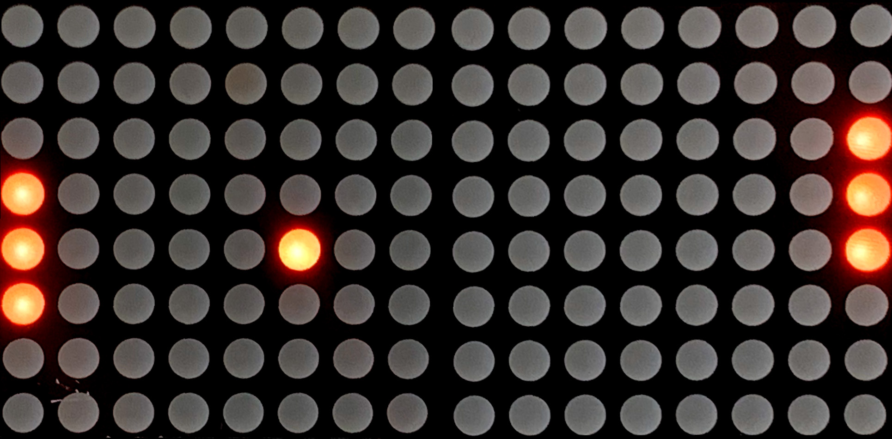
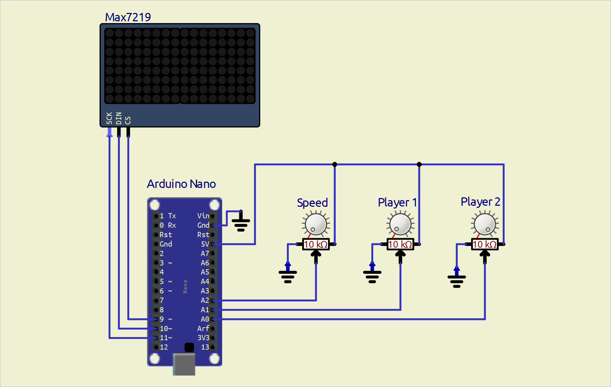

# Pong with Arduino and MAX72xx

## Introduction
This project is a simple implementation of the classic Pong game using an Arduino and 2 8x8 LED matrix displays driven by a MAX72XX chip. The game is controlled using two potentiometers, allowing two players to move their paddles up and down to bounce the ball back and forth. An additional potentiometer is used to control the ball's speed.

## Features
- Two-player Pong game
- Smooth paddle and ball movement
- Adjustable game speed
- Compact design using 2 8x8 LED matrices

## Circuit Diagram

## Installation
1. **Clone the repository:**

2. **Install the necessary library:**
    - [LedControl](https://github.com/wayoda/LedControl)

    You can install the library via the Arduino Library Manager

3. **Upload the code:**
    Open `main.cpp` (change to .ino if needed) in the your IDE of choice, select your board and port, and upload the sketch to your Arduino.

## Usage
1. **Connect the potentiometers and the LED matrix module to your Arduino as per the circuit diagram.**
2. **In this project the displays have to be rotated 90 degrees counterclockwise each**
3. **Power your Arduino.**
4. **The game should start automatically. Use the potentiometers to control your paddles and enjoy the game!**

## Code Explanation

### Game Logic
- **Ball Movement:** Calculate the new position of the ball and check for collisions with the paddles and walls.
- **Paddle Movement:** Read the potentiometer values to move the paddles up and down.
- **Display Update:** Update the LED matrix with the new positions of the ball and paddles.

### Main Loop
The main loop continuously updates the game state by:
- Reading the potentiometer values.
- Updating the positions of the ball and paddles.
- Redrawing the LED matrix.